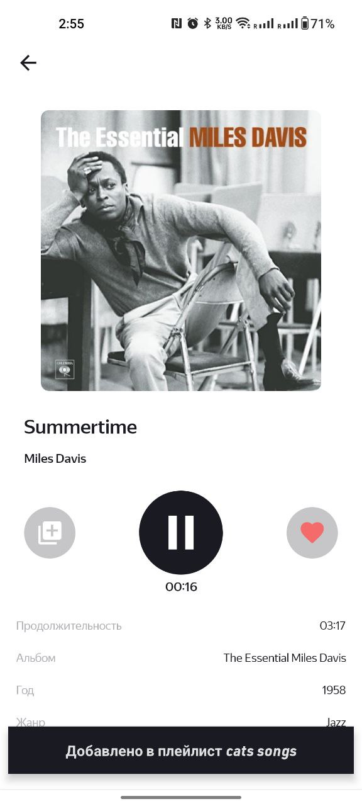
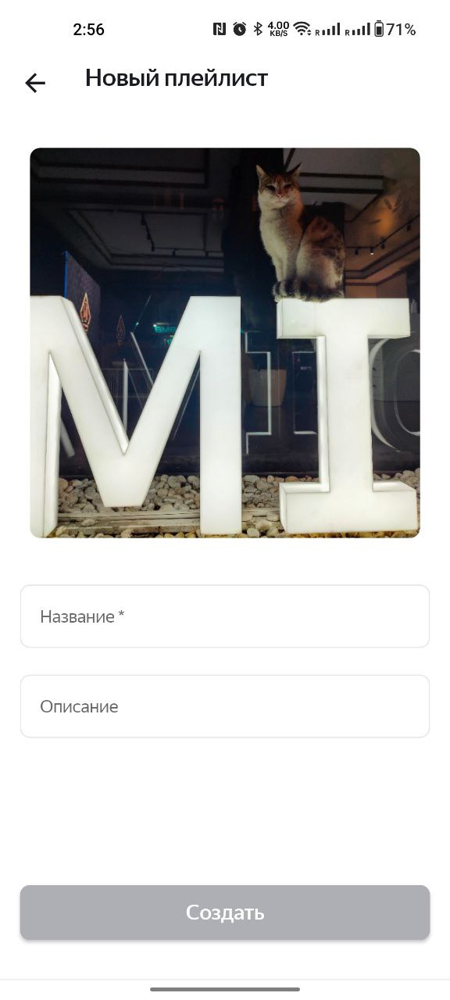

# PlaylistMaker


[](https://kotlinlang.org)

PlaylistMaker app using [iTunes Search API](https://developer.apple.com/library/archive/documentation/AudioVideo/Conceptual/iTuneSearchAPI/index.html#//apple_ref/doc/uid/TP40017632-CH3-SW1) <br>
The app is dedicated to searching tracks in itunes and creating playlists.
Implemented options to search tracks, create/edit/delete playlists, change the application theme.
<br>
### Stack: 
- [Android Studio](https://developer.android.com/studio/intro)
- Coroutines + Flow
- Arcitecture: MVVM+LiveData, Single Activity + Android Navigation,
- DB: Room Persistent Library
- Network: Retrofit2,
- Mediaplayer
- DI - Koin
- File
- Coil

## Screencast 

[](https://www.youtube.com/watch?v=lTojN-d4ipk&ab_channel=Zinchenko)

        


## Screenshots

 
 
 
 
 
 

## Getting Started 🛠

1. Clone this repository to your local machine.
    ```text
    git clone https://github.com/GoetzDeBouville/PlaylistMaker.git
    ```

2. Open the project in Android Studio.

4. Set up your Android device/emulator/simulator.

5. Build and run the project.


## Contributing :writing_hand:

Contributions are welcome! If you find any issues or have suggestions for improvements, please open an issue or submit a pull request.


## Contributors 📢

<a href="https://github.com/GoetzDeBouville/PlaylistMaker/graphs/contributors">
    
</a>


### Contact me  📬

<p align="left">

[](https://www.linkedin.com/in/aleksey-zinchenko-9b3760252/)
[](https://t.me/heoderer)
[](https://www.facebook.com/double.conscience)
</p>
